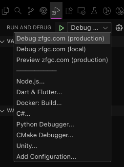

# Contributing

When contributing to this repository, please first discuss the change you wish to make via issue,
email, or any other method with the owners of this repository before making a change.

Please note we have a code of conduct, please follow it in all your interactions with the project.

TBD. We could use some help writing this out.

## Table of Contents

- [Contributing](#contributing)
  - [Table of Contents](#table-of-contents)
  - [Development](#development)
    - [Downloading the Project](#downloading-the-project)
      - [Quick Start (With VSCode Dev Container)](#quick-start-with-vscode-dev-container)
      - [Quick Start](#quick-start)
    - [Workflow - Typical Development Workflow](#workflow---typical-development-workflow)
    - [package.json - Provided package.json scripts](#packagejson---provided-packagejson-scripts)
      - [`yarn dev`: Starts the development server](#yarn-dev-starts-the-development-server)
      - [`yarn build`: Builds the application for production](#yarn-build-builds-the-application-for-production)
        - [Packaging for Production](#packaging-for-production)
      - [`yarn check`: Runs type checking, linting, and formatting checks](#yarn-check-runs-type-checking-linting-and-formatting-checks)
      - [`yarn format`: Formats the code using Prettier](#yarn-format-formats-the-code-using-prettier)
      - [`yarn preview`: Runs the application in the production mode](#yarn-preview-runs-the-application-in-the-production-mode)
        - [Troubleshooting](#troubleshooting)
          - [Why is the forum not loading?](#why-is-the-forum-not-loading)
          - [Why does the `yarn check` command fail for Icon Components?](#why-does-the-yarn-check-command-fail-for-icon-components)
      - [VSCode - Usage](#vscode---usage)
        - [VSCode - Recommended Extensions](#vscode---recommended-extensions)
        - [VSCode - Typescript Workspace Version](#vscode---typescript-workspace-version)
        - [VSCode - Running the application (Launch Tasks)](#vscode---running-the-application-launch-tasks)
  - [CI/CD \[WIP\]](#cicd-wip)
    - [.github/workflows/workflows-ci.yml](#githubworkflowsworkflows-ciyml)
    - [./github/workflows/workflow-deploy-frontend.yml](#githubworkflowsworkflow-deploy-frontendyml)

## Development

We recommend using [VSCode](#vscode---usage) for development. If you are not using [VSCode](#vscode---usage), you can use the provided package.json scripts to get started.

### Downloading the Project

1. Make sure you have [Node.js](https://nodejs.org/en/download/) installed. (We recommend using the current LTS version).
   1. If you are using [nvm (optional)](https://github.com/nvm-sh/nvm), you can use `nvm use` to switch to the correct version.
   2. We provide a configuration for [VSCode](https://code.visualstudio.com/), and is recommended for development.
2. Make sure you have [Git](https://git-scm.com/downloads) installed.
   1. We recommend using [GitHub Desktop (optional)](https://desktop.github.com/) or [GitHub CLI (optional)](https://cli.github.com/), if you are new to Git.
   2. For Nix Users ONLY, you can also install [Nix (optional)](https://nixos.org/download.html) and [direnv (optional)](https://direnv.net/), which can be used to automatically install the correct version of Node.js and other tools, since there's a [flake.nix](./flake.nix) file in the repository.
3. Clone the repository

   ```bash
   git clone https://github.com/ZFGCCP/ZFGCBB-React.git
   ```

4. Now, you can either continue with [Quick Start (With VSCode Dev Container)](#quick-start-with-vscode-dev-container) or [Quick Start](#quick-start), if you prefer to use your local machine for development.
5. Happy hacking! Hack the planet!

#### Quick Start (With VSCode Dev Container)

There is a [dev container](./.devcontainer/README.md) for ZFGCBB-React. It is currently the easiest way to get started, so you can ignore the rest of this document if you just want to get started quickly.

1. Install [Docker Desktop](https://www.docker.com/products/docker-desktop/) and [VS Code Remote - Containers](https://marketplace.visualstudio.com/items?itemName=ms-vscode-remote.remote-containers).
2. Open the repository in VS Code.
3. Open the Command Palette (Ctrl+Shift+P).
4. Type in `Dev Containers: Open Folder in Container`
   1. Select "Dev Containers: Open Folder in Container".
5. Wait for the container to start.
6. That's it, you can now start coding! \o/
7. You can now proceed to [Workflow - Typical Development Workflow](#workflow---typical-development-workflow) for more information for contributing to the project.
   1. Feel free to check out the [package.json](#packagejson---provided-packagejson-scripts) section for more development information.

#### Quick Start

Follow the steps below to get started with the project, if you are setting up the development environment on your local machine, and are
not using the provided dev container from [Quick Start (With VSCode Dev Container)](#quick-start-with-vscode-dev-container).

1. Configure the project (Have the prequisites installed - see [Downloading the Project](#downloading-the-project)) We use [corepack](https://nodejs.org/api/corepack.html) to manage the package manager, so make sure to run the following command to enable it. This is a one time setup.

   ```bash
   # Make sure you are in the project directory that you cloned.
   npm install -g corepack@latest
   corepack enable
   ```

   **_NOTE: If you are using [VSCode](#vscode---usage), you can use the `Debug zfgc.com (local/dev)` launch task to do this for you. This will also let you set breakpoints and debug your code in VSCode._**

2. Install the dependencies

   ```bash
   yarn install
   ```

3. Start the development server

   ```bash
   yarn dev
   ```

4. Open your browser and navigate to <http://localhost:5173>.
5. You can now proceed to [Workflow - Typical Development Workflow](#workflow---typical-development-workflow) for more information for contributing to the project.
   1. Otherwise, we recommend continuing to the [VSCode - Usage](#vscode---usage) section for more information on how to use the `Debug zfgc.com (live/dev)` task for easy setup.
   2. Feel free to check out the [package.json](#packagejson---provided-packagejson-scripts) section for more development information.

### Workflow - Typical Development Workflow

If this is your first time contributing to this project, or cloning the repository, we recommend following the steps below. It will guide you through the process of creating a new branch, making changes, and submitting a pull request.

1. Read the [Code of Conduct](CODE_OF_CONDUCT.md).
   1. If you do not agree with the Code of Conduct, please do not contribute to this project. Feel free to fork the repository and create your own version of the project.
   2. Check the [Projects Board](https://github.com/users/ZFGCCP/projects/4) for open issues that you can help with.
2. If you are not part of the ZFGCCP organization, you will need to fork this repository.
3. When making commits, please sign your commits with `git commit -s`, to certify that you have the rights to submit the work under the [Developer Certificate of Origin](https://developercertificate.org/).
   1. GitHub has a decent [help article](https://docs.github.com/en/authentication/managing-commit-signature-verification/signing-commits) on signing commits. You can use this to help you sign your commits.
4. Make sure you are on the `development` branch. `git switch development && git pull`.
5. Make a new branch for your changes. `git switch -c my-new-branch`.
   1. How do I name my branch? See the next section, we have some recommendations, but we don't have any official rules so you can use whatever naming convention you prefer for your branch.
   2. Branch Naming Conventions (General Recommendations)
      1. If you are working on a new feature, you can name your branch `feature/my-new-feature`.
      2. If you are working on a bug fix, you can name your branch `bugfix/my-bug-fix` or `fix/my-bug-fix`.
      3. If you are working on a documentation change, you can name your branch `docs/my-docs-change`.
      4. If you are working on a refactor, you can name your branch `refactor/my-refactor`.
      5. If you are working on a test, you can name your branch `test/my-test`.
      6. As an optional convention, you can prefix your branch name with your username, e.g., `vashsbutthole/feature/my-new-feature`.
      7. You are ready to start working on your branch!
   3. Create the branch on GitHub. (If you are just simply trying to run the project locally, you can skip this step! Proceed to `Step 5 - Working on your changes`)
      1. If you are not a team member, you will need to fork the repository to create a branch.
         1. To fork the repository, click the "Fork" button in the top right corner of the repository page.
         2. Once you have forked the repository, if you created the branch locally, you can push the branch to your forked repository by creating the origin remote and pushing the branch.
            1. `git remote add origin https://github.com/your-username/ZFGCBB-React.git` just make sure to replace `your-username` with your GitHub username.
   4. If you are a team member, you can create the branch directly on GitHub.
6. Working on your changes: Use your IDE of choice to edit files and save changes. We recommend using [VSCode](#vscode---usage) for development.
   1. Make sure to run `yarn install` every time you check out a branch.
      1. To understand the commands, see the [package.json](#packagejson---provided-packagejson-scripts) provided scripts section. But for now, we recommend just continuing through the guide.
   2. Use the `yarn dev` command to start the development server. But before you do, continue reading until you reach `Step 5.iii - Use the "yarn format" command to format the code using Prettier`, due to a current limitation with running the development server in local only mode.
      1. If you are using VSCode, you can use the `Preview zfgc.com (production)` launch task to do this for you.
      2. For now, if cloning the [backend](https://github.com/ZFGCCP/ZFGCBB) is too much of a hassle, you can use the `yarn dev --mode=production` command to start the development server on `zfgc.com` or `Debug zfgc.com (local)` in VSCode. See the VSCode usage [reference](#vscode---usage) for more information on how to use the `Debug zfgc.com (production)` task. <!-- FIXME: remove this note when we have a container that can be pulled down and run locally -->
   3. Use the `yarn format` command to format the code using Prettier.
   4. Use the `yarn build` command to build the application for production.
   5. Use the `yarn check` command to run type checking, linting, and formatting checks.
      1. Note: The `yarn check` command requires types to be generated from the `yarn build` command, so make sure to run `yarn build` before running `yarn check` at least once.
   6. Repeat `yarn check` as needed until you every file is fixed, and the check passes.
      1. Feel free to reach out on Discord if you have any questions.
      2. Consult the [package.json](#packagejson---provided-packagejson-scripts) section for more development information, and help.
   7. Stage and commit your changes.
   8. Push your changes to your branch on GitHub.
7. [Create a new pull request](https://github.com/ZFGCCP/ZFGCBB-React/compare) and request a review from one of the maintainers.
   1. Add a bullet point list of changes you made.
   2. Mention the issue number you are working on.
      1. If there is no issue, you can create one.
   3. Title the pull request using conventional commits, with `closes #issue-number` included, if applicable.
      1. Example: `feat: add new feature`
      2. See: <https://www.conventionalcommits.org/en/v1.0.0/>
   4. For the duration of your pull request, please keep your branch up to date with the `development` branch.
      1. It is RECOMMENDED that you use `git pull --rebase` to keep your branch up to date with the `development` branch.
   5. Please squash your commits into a single commit, if possible. We prefer using `git rebase` in favor of `git merge`.
   6. Your PR must pass all checks before it can be merged or requested for review.
8. As Sonic the Hedgehog says, "Gotta go fast!". And you went fast! Congratulations on making a contribution to the project!

### [package.json](package.json) - Provided package.json scripts

The `yarn dev` and `yarn build` commands reference the [.env.local](.env.local) file or if specified, the [.env.production](.env.production) file. Utilizing the [.env.production](.env.production) file provides a method for testing the frontend against the production backend hosted on [zfgc.com](http://zfgc.com).

Specifying an environment can be done by using the `--mode` flag.

For example, to run the frontend in production mode, you can use the following command:

```bash
yarn dev --mode=production
```

The same flag can be used with the `yarn build` command, with the same effect.

Continue reading to learn more about the package.json scripts.

#### `yarn dev`: Starts the development server

This command starts the development server, using [react-router/dev](https://reactrouter.com/start/framework/installation) and `vite`. `react-router` builds on top of `vite` to create a development server.

Since `yarn dev` forwards to `react-router dev`, the arguments for `react-router` can be forwarded to `yarn dev` as well.

#### `yarn build`: Builds the application for production

This command builds the application for production, using [react-router](https://reactrouter.com/tutorials/quickstart#build-and-run).

Since `yarn build` forwards to `react-router build`, the arguments for `react-router` can be forwarded to `yarn build` as well.

##### Packaging for Production

The `yarn build` command will package the application for production. The `NODE_ENV` environment variable is set to `production` by default on most systems. If you wish to override this, you can use the `--mode` flag. [See above for more information](#packagejson---provided-packagejson-scripts).

```bash
yarn build --mode=production
```

This will package the application for production and output the production build to the `build/client` directory in the project root.

If you have zip installed, you can use the following command to create a zip file of the production build.

```bash
rm -f build.zip && zip -rj build.zip build/client/
```

#### `yarn check`: Runs type checking, linting, and formatting checks

This commands runs type checking, linting, and formatting checks using [TypeScript](https://www.typescriptlang.org/) and [Prettier](https://prettier.io/), and [react-router](https://reactrouter.com/tutorials/quickstart#build-and-run)'s typegen command. It will throw an error if any of the checks fail.

Note: The `yarn check` command requires types to be generated from the `yarn build` command, so make sure to run `yarn build` before running `yarn check` at least once.

#### `yarn format`: Formats the code using Prettier

This command formats the code using [Prettier](https://prettier.io/).

#### `yarn preview`: Runs the application in the production mode

This command runs the react-router-serve server, using [react-router](https://reactrouter.com/tutorials/quickstart#build-and-run). It is used to run a production build of the application locally, pointed to `zfgc.com`.

This command runs the application in SSR Mode, using [react-router](https://reactrouter.com/tutorials/quickstart#build-and-run). See also documentation for [react-router SPA Mode](https://reactrouter.com/how-to/spa) for more context over the differences between SPA Mode and SSR Mode.

Note: The `yarn preview` command requires types to be generated from the `yarn build` command, so make sure to run `yarn build` before running `yarn preview` at least once.

##### Troubleshooting

###### Why is the forum not loading?

The default value is pointing to your local machine. While we do have dockerfiles for the backend, we haven't gotten around to streamlining using the backend in a development setting for the frontend. To run the frontend locally, pointed to `zfgc.com`, run `yarn dev --mode=production`, and that will point to the production environment. This will get you up and running! \o/ Sometimes this issue may come up because you closed the server in the background, and the app is working off of cache state.

###### Why does the `yarn check` command fail for Icon Components?

If you get an error like this:

```text
src/root.layout.tsx:70:14 - error TS2304: Cannot find name 'Fa6SolidBars'.

               <Fa6SolidBars />
                ~~~~~~~~~~~~


Found 10 errors in 4 files.
```

This is likely due to the fact that the `yarn check` command requires types to be generated from the `yarn build` command, so make sure to run `yarn build` before running `yarn check` at least once.

#### VSCode - Usage

VSCode is our preferred IDE for development. To get the best experience, try installing the recommended extensions. The provided launch tasks will automatically configure the project for you and allow you to set breakpoints and debug your code. Continue to [VSCode - Recommended Extensions](#vscode---recommended-extensions) for more information.

##### VSCode - Recommended Extensions

This project provides [extension recommendations](./.vscode/extensions.json) for VSCode. Press `(CRTL/CMD + SHIFT + X)` to open the Extensions panel on the sidebar. You can use the `@recommended` tag to only install extensions that are recommended by this project. See <https://code.visualstudio.com/docs/configure/extensions/extension-marketplace#_recommended-extensions> for more information.


If the sidebar looks like this, then you can install the recommended extensions if the option is available. After you've installed the recommended extensions, you can continue to [VSCode - Typescript Workspace Version](#vscode---typescript-workspace-version) for more information.

##### VSCode - Typescript Workspace Version

Please be sure to allow the [Typescript Workspace Version](https://code.visualstudio.com/docs/typescript/typescript-compiling#_using-the-workspace-version) to be enabled. This will allow you to get type checking and intellisense for the entire project.


If you cannot find the notification, then you can use the command palette to achieve the same thing. \*NOTE: Open a TypeScript file first, such as [src/root.tsx](src/root.tsx). Otherwise the `Typescript: Select Typescript Version` won't be available as an option.

You can press `(CRTL/CMD + SHIFT + P)` to open the Command Palette. Then, type `TypeScript: Select TypeScript Version` and select `Use Workspace Version`.


Then you should be prompted to select a version. Select `Use Workspace Version`.


If a notification pops up, you will need to press `Allow`. After you've pressed `Allow`, you can proceed to [VSCode - Running the application (Launch Tasks)](#vscode---running-the-application-launch-tasks) for more information.

##### VSCode - Running the application (Launch Tasks)

The VSCode project is setup with two [launch tasks](./.vscode/launch.json):

Find the launch tasks by navigating to the `Run and Debug` section `(CRTL/CMD + SHIFT + D)` of the sidebar.



Each of these launch tasks will `corepack enable` and `yarn install` before running the application, so you do not need to worry about that. See [.vscode/tasks.json](./.vscode/tasks.json) if you would like to see how these tasks run those commands.

- `Debug zfgc.com (production)`: Runs the application in production mode with the API calls pointed to `zfgc.com` for the backend, using the value of `REACT_ZFGBB_API_URL` in [.env.production](.env.production). This uses the `development` build of the application with variables loaded from [.env.production](.env.production), by calling [yarn build --mode=production](#yarn-build-builds-the-application-for-production).
- `Debug zfgc.com (local/dev)`: Runs the application in development mode with the API calls pointed to <http://localhost:8080/zfgbb> or the value of `REACT_ZFGBB_API_URL` in [.env.local](.env.local). This uses the `development` build of the application, by calling [yarn dev](#yarn-dev-starts-the-development-server).
- `Preview zfgc.com (production)`: Runs the application in production mode with the API calls pointed to `zfgc.com` for the backend, using the value of `REACT_ZFGBB_API_URL` in [.env.production](.env.production). This uses the `production` build of the application with variables loaded from [.env.production](.env.production), by calling `yarn build --mode=production`. The server is provided by [yarn preview](#yarn-preview-runs-the-application-in-the-production-mode).

Now that you are ready, you can proceed to [Workflow - Typical Development Workflow](#workflow---typical-development-workflow) for more information.

## CI/CD [WIP]

We use GitHub Actions to run the CI/CD pipeline.

### [.github/workflows/workflows-ci.yml](.github/workflows/workflow-ci.yml)

This workflow builds and tests the project on each pull request.

### [./github/workflows/workflow-deploy-frontend.yml](.github/workflows/workflow-deploy-frontend.yml)

This workflow builds and deploys the project to GitHub Pages.
